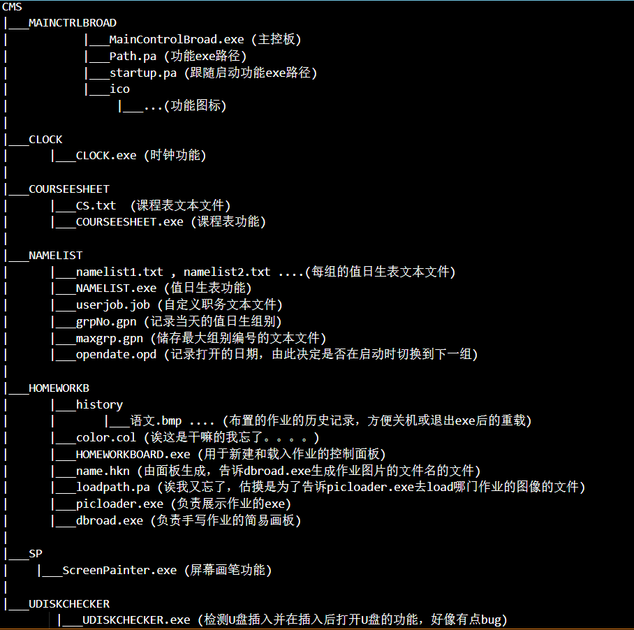

# ClassManagementSystem
 一个扩展性极高的班级管理系统，主要用VBA写的
 
 至于其扩展性极高的原因，是由这个系统的结构决定的
 下面展示一下整个系统的结构
 
</img>

### 可以看到，各个功能是分离的EXE
这样的结构可以很方便的像系统内添加功能，只要自己写一个exe，然后把路径和要在主控板上显示的图标(一般是jpg之类的图像，不用ico)加入到path.pa中然后重启主控板，新功能就会完成添加(显然主控板是用了动态的控件数组)

##### 提示：可以看到Release文件夹里的主控板其对应的path.pa中，前四个功能使用了相对与CMS.exe的路径
##### 原因是前四个功能写的不规范，这几个exe打开文件的时候都直接使用了相对于自己的路径
##### 但是一旦被CMS.exe调用，他们的startup path就变成了CMS.exe所在的文件夹，于是会发生找不到文件的情况。
##### 但是把这个路径写成相对于CMS.exe的就不会有这样的问题
